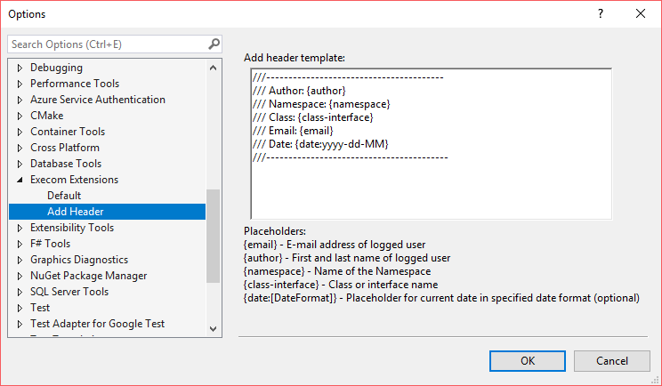

# Execom Extensions 

Contains various commands which are installed as extension package in Visual Studio 2017. Goal of commands is to help developers in their development.

## Getting Started

These instructions will get you a copy of the project up and running on your local machine for development and testing purposes.

#### Prerequisites

If you want to contribute or start developing your own extension you'll need a few things before start. You need to install the Visual Studio SDK in addition to Visual Studio. 

Best starting point for development and setup of the environment is [Microsoft Documentation](https://docs.microsoft.com/en-us/visualstudio/extensibility/visual-studio-sdk).

#### Installing

After you've finished setting up your environment, installing the extension is very easy. Follow the steps below and you can't make a mistake.

1. Download source code
2. Set up its building configuration to Release (default one)
3. Build the project
4. Open output directory. **ExecomExtensions.vsix** file should been generated.
5. Close all instances of VS 2017.
6. Install the extension by double clicking on it.

And that's it! You have built and installed the extension.

## Commands

This section contains list of all commands inside the Execom Extensions package.

Commands:

1. **Add Header** - is used from text editor context and adds predefined header to the file
2. **Open Output Folder** - used on project context and opens defined output directory of the project

### Version 1.0.0

##### Add Header

Command is used for adding predefined header to a file. Before usage it would be good to customize your own predefined header. It can be customized in Visual Studio options, under category *Execom Extensions* (see image below). (*Tools -> Options... -> Execom Extensions*). 

Placeholders will be substituted with relevant data. 

After customizing your header, you can use the command. Right click on an opened file in your Visual Studio text editor. **Add Header** command is located (see image below) on top of the context menu.

If you are logged in in Visual Studio, and still the result for *{author}* and *{email}* is *(Unknown)*, please check the destination of your *Registry Sub Key*. Default Sub Key is defined in *Default* section under *Execom Extensions* category.

##### Open Output Folder

Command is used for opening the output folder of certain project. To use command, right click on a project inside of your solution in Visual Studio 2017. A context menu should pop up. In the context menu select **Open Output Folder** command (see image below). Location of output folder of the project is opened in File Explorer.

## License

This project is licensed under the GNU General Public License v3.0 License - see the [LICENSE](https://github.com/execom-eu/visual_studio_extensions/blob/master/LICENSE) file for details